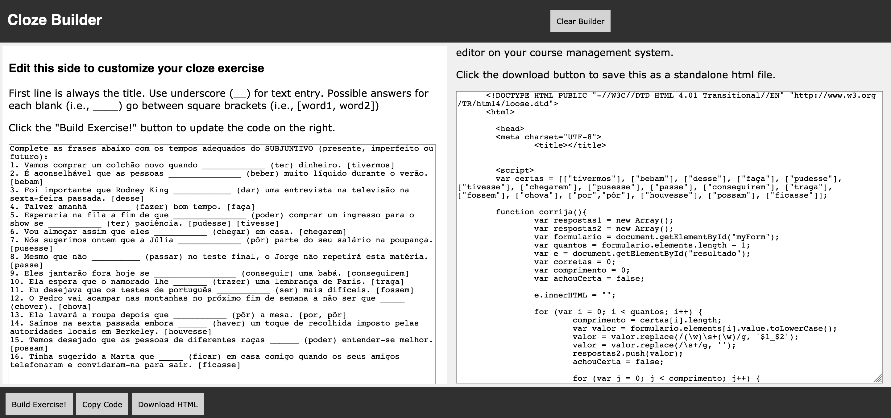

# Cloze HTML builder
The Cloze HTML builder is a tool for language teachers. Enter your text on the area on the left of the interface to generate html code that allows students to self check their answers. You can either download the generated code as a standalone webpage, that you can then upload to your course management system or another web server, or you can copy and paste the code to a HTML editor in your course management system.

When you open the tool, an example in Portuguese is pre-loaded.

